# Chill check api
Node.Js + Express
"Powered by Kubios"

Start server: `npm run dev`
# <h3><b>Usage<b></h3>

1. Clone/download code.
2. Run ```npm i``` inside the project folder
3. Install & start Mysql/MariaDB server
4. Import database script in database branch
5. Create .env file based on .env.sample
6. Start the dev server: npm run dev/npm run start

<h3><b>Link to our frontend and the websites front page:<b></h3>

- https://github.com/Jaakvi/chillcheck-projekti/tree/frontend/front
- https://hyte-server-aura.northeurope.cloudapp.azure.com/etusivu.html
-


# <h3><b>/api/auth<b></h3>
example queries

```

  #Login
  POST https://hyte-server-aura.northeurope.cloudapp.azure.com/api/users/login
  content-type: application/json
  ## this happens through kubios so you will need to have a kubios account and to implement this, you need your own client-id for Kubios. More important information is in .env.sample
  {
    "username": "john.doe@example.com",
    "password": "Hashed_password4"
  }

  ## Get user by token (requires token)
  GET https://hyte-server-aura.northeurope.cloudapp.azure.com/api/auth/me
  Authorization: Bearer <token>

```
# <h3><b>/api/users<b></h3>

example queries

```
  # Get all users (requires token)
  GET https://hyte-server-aura.northeurope.cloudapp.azure.com/api/users
  Authorization: Bearer <token>

  # Get user by id (requires token)
  GET https://hyte-server-aura.northeurope.cloudapp.azure.com/api/users/:id
  Authorization: Bearer <token>

  # Delete user (requires token)
  DELETE https://hyte-server-aura.northeurope.cloudapp.azure.com/api/users/:id
  Authorization: Bearer <token>

  # Create user (register)
  POST https://hyte-server-aura.northeurope.cloudapp.azure.com/api/users
  content-type: application/json

  {
    "username": "johndoe4",
    "password": "hashed_password4",
    "firstname": "John",
    "lastname": "Doe",
    "email": "email@email.com"
  }

  # Update user's own data (requires token)
  PUT https://hyte-server-aura.northeurope.cloudapp.azure.com/api/users/
  Authorization: Bearer <token>
  content-type: application/json

  {
    "username": "johndoe4",
    "password": "hashed_password4",
    "firstname": "John",
    "lastname": "Doe",
    "email": "email@email.com"
  }

```


# <h3><b>/api/kubios<b></h3>

example queries
```
# Get all Measurement of user that has logged in (requires token)
GET https://hyte-server-aura.northeurope.cloudapp.azure.com/api/kubios/user-data
Authorization: Bearer <token>

# Get the profile data of the user that has logged in
GET https://hyte-server-aura.northeurope.cloudapp.azure.com/api/kubios/user-info
Authorization: Bearer <token>
```

<h3><b>Database structure<b></h3>

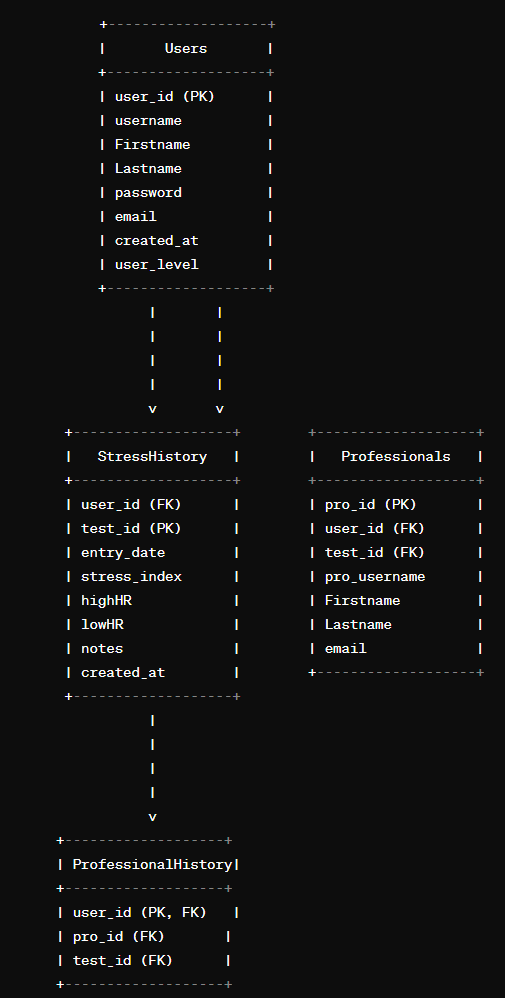!

<h3><b>Frontend UI<b></h3>
<h4><b>Before:<b></h4>

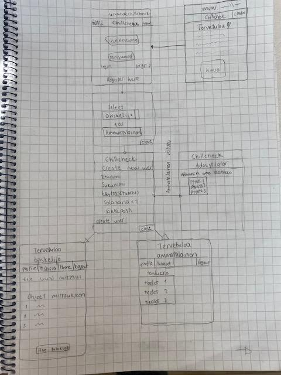

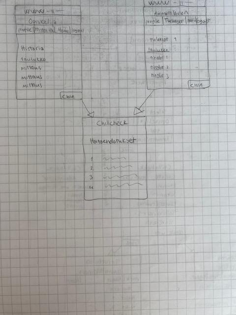


<h4><b>Now:<b></h4>

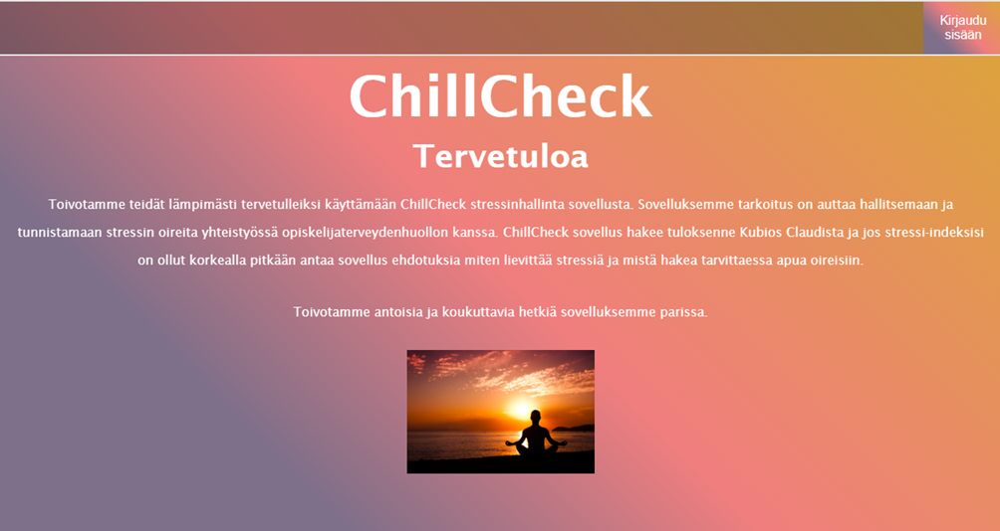

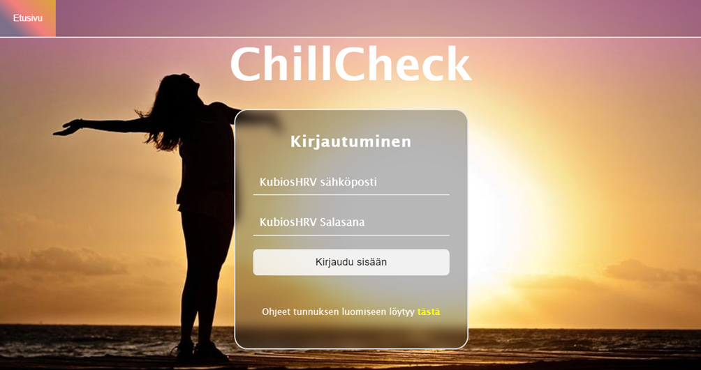

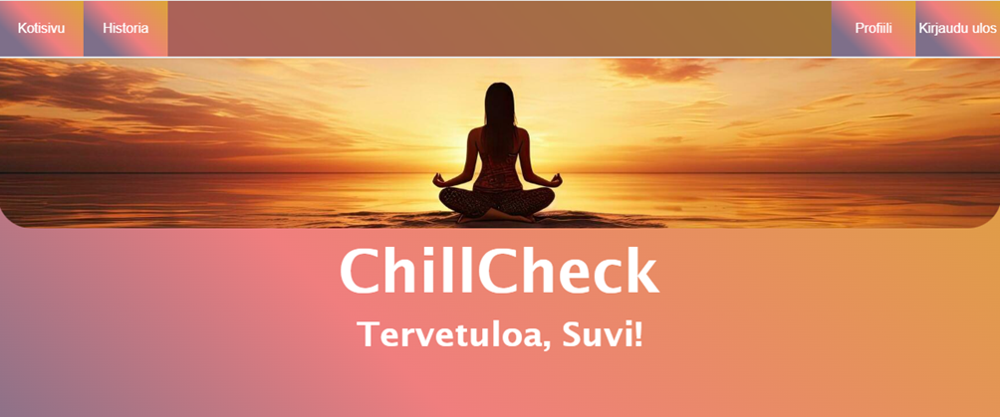

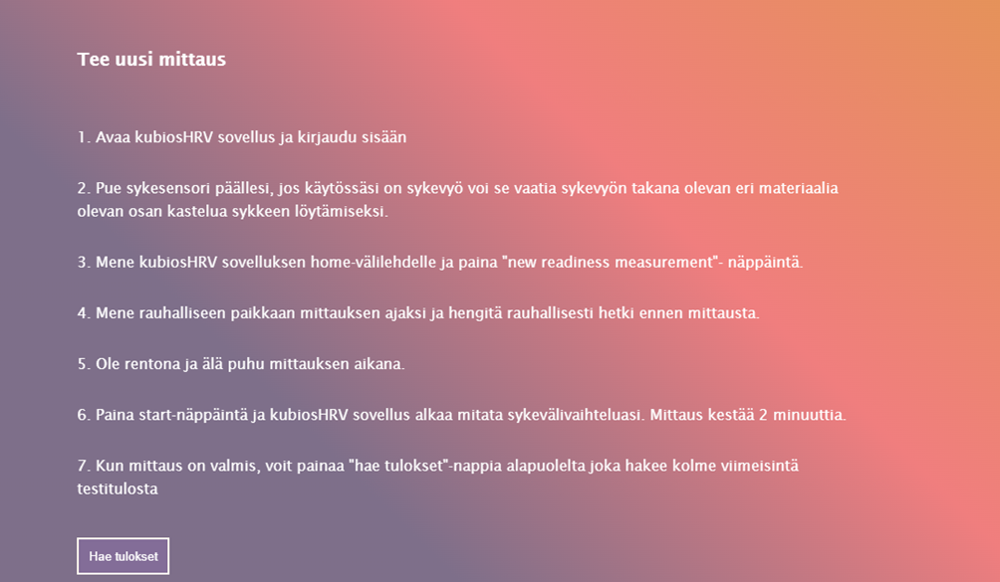

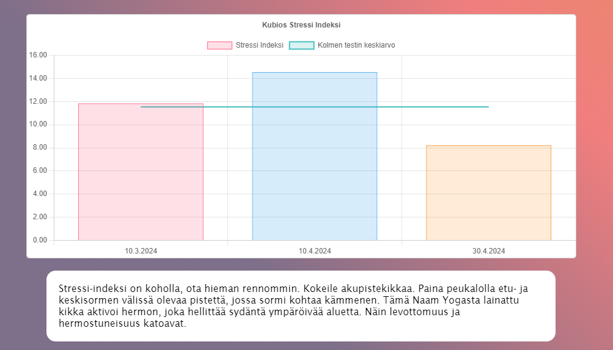

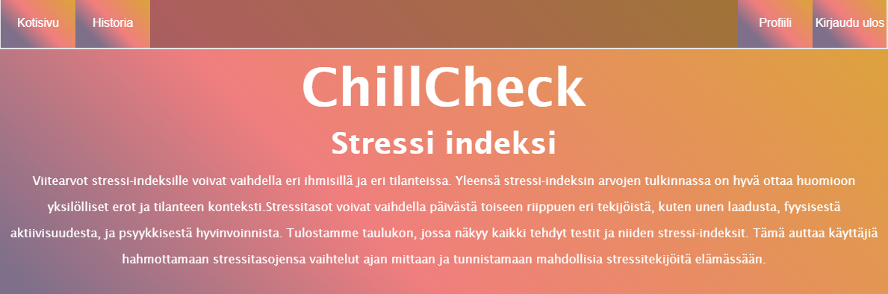
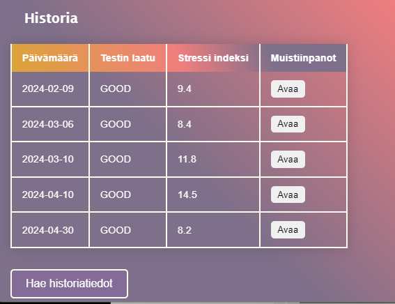
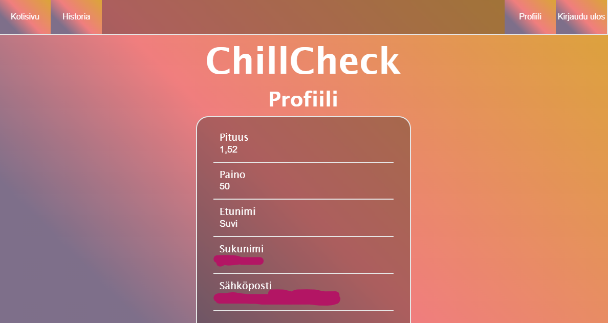

<h3><b>Known bugs:<b></h3>


1. Some graphical anomalies might happen

<h3><b>To be implemented:<b></h3>

- Updating user information in kubios
- professional verification
- measurement values to database


<h3><b>Robot framework testing<b></h3>

- https://github.com/Jaakvi/chillcheck-projekti/tree/testaus

<h3><b>Refrences:<b></h3>

- Forms style (https://medium.com/@bijanrai/rsponsive-animated-login-form-in-html-css-javascript-43b55a8adedb)
- [Banner picture](https://www.google.com/search?q=meditation+in+sunset&sca_esv=87522dea2824ff52&rlz=1C1CHBD_fiFI1081FI1083&udm=2&biw=1280&bih=585&ei=zgg6ZoulPOuzwPAP6MuTkAw&ved=0ahUKEwiLxKHHsPuFAxXrGRAIHejlBMIQ4dUDCBA&uact=5&oq=meditation+in+sunset&gs_lp=Egxnd3Mtd2l6LXNlcnAiFG1lZGl0YXRpb24gaW4gc3Vuc2V0MgcQABiABBgTSLw-UABYqztwAngAkAEAmAE9oAHNB6oBAjIxuAEDyAEA-AEBmAIWoAKLCKgCAMICChAAGIAEGEMYigXCAgUQABiABMICBBAAGAPCAggQABiABBixA8ICCxAAGIAEGLEDGIMBwgIEEAAYHpgDAZIHAjIyoAe7VA&sclient=gws-wiz-serp#vhid=jS2Xq6I-vUEE-M&vssid=mosaic)
- [Front page picture](https://www.google.com/search?q=meditation+of+human&sca_esv=87522dea2824ff52&rlz=1C1CHBD_fiFI1081FI1083&udm=2&biw=1280&bih=585&ei=Hwo6ZuuMD9POwPAPufWx-Aw&ved=0ahUKEwirmM3nsfuFAxVTJxAIHbl6DM8Q4dUDCBA&uact=5&oq=meditation+of+human&gs_lp=Egxnd3Mtd2l6LXNlcnAiE21lZGl0YXRpb24gb2YgaHVtYW5I3SJQgQZYvCBwAXgAkAEAmAE4oAG6A6oBATm4AQPIAQD4AQGYAgagApQCwgIKEAAYgAQYQxiKBcICBRAAGIAEwgIEEAAYHsICBxAAGIAEGBPCAgYQABgIGB6YAwCIBgGSBwE2oAfPGA&sclient=gws-wiz-serp#vhid=R3mFPnZpd5zCsM&vssid=mosaic)

- [Login page picture](https://www.google.com/search?q=stress+free&sca_esv=4d50ecf86976fd48&rlz=1C1CHBD_fiFI1081FI1083&udm=2&biw=1263&bih=673&ei=vlM6ZrHGDee7wPAP4JOmkAY&ved=0ahUKEwixncWC-PuFAxXnHRAIHeCJCWIQ4dUDCBA&uact=5&oq=stress+free&gs_lp=Egxnd3Mtd2l6LXNlcnAiC3N0cmVzcyBmcmVlMgUQABiABDIEEAAYHjIEEAAYHjIEEAAYHjIEEAAYHjIEEAAYHjIEEAAYHjIEEAAYHjIEEAAYHjIEEAAYHkj5F1AAWNwWcAF4AJABAJgBTaABiAWqAQIxMbgBA8gBAPgBAZgCC6ACyQWoAgDCAgoQABiABBhDGIoFwgIIEAAYgAQYsQPCAg4QABiABBixAxiDARiKBcICCxAAGIAEGLEDGIMBwgIEEAAYA5gDApIHAjExoAfeNA&sclient=gws-wiz-serp#vhid=z1I4EiH9HdnKZM&vssid=mosaic)

- [Hoitoehdotukset saatu tästä](https://yle.fi/aihe/artikkeli/2013/09/13/20-tapaa-helpottaa-akillista-stressia)


